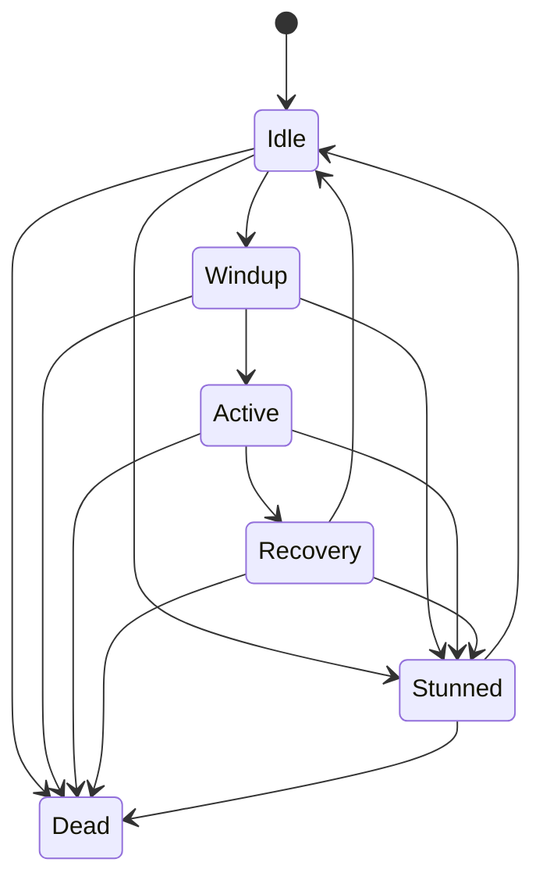

# Roblox Combat Framework

A focused Roblox Luau portfolio sample: explicit combat states, server-owned
ability definitions, bounded melee queries, request throttling, and lifecycle
cleanup. Includes Slash and Heavy examples.

**Verification status:** Generated source, not verified in Roblox Studio.
No Luau type-check, automated test, multiplayer test, or Rojo build is claimed.
Every Luau source starts with `--!strict`; that is a checking directive, not
proof that analysis passes. Run Script Analysis and the checks below.

## Reviewer entry points

- `CombatService.luau`: validation, cast scheduling, interruption, lifecycle.
- `StateMachine.luau`: typed states and permitted transitions.
- `Hitbox.luau`: server-side overlap, range, obstruction, and team checks.
- `tests/Core.spec.luau`: executable assertions for isolated primitives.
- `docs/VALIDATION.md`: multiplayer and adversarial verification checklist.

## Architecture

```mermaid
flowchart LR
    Input[Client input] -->|ability ID only| Request[RemoteEvent]
    Request --> Limit[Per-player token bucket]
    Limit --> Validate[Server validation]
    Validate --> Cast[State and cooldown commit]
    Cast --> Heartbeat[Server phase scheduler]
    Heartbeat --> Hitbox[Server hitbox query]
    Hitbox --> Damage[Damage and interruption]
```





Dead is terminal for an actor. Respawn creates a new actor. Cooldowns and rate
limits belong to the player session and survive respawn until the player leaves.

## Setup with Roblox Studio

Use a new Baseplate or a copy of your place.

1. Create `ReplicatedStorage/Combat` as a Folder.
2. Add `Types` as a ModuleScript with `src/shared/Types.luau`.
3. Add RemoteEvents named `AbilityRequest` and `AbilityFeedback`.
4. Create `ServerScriptService/Combat` as a Folder.
5. Add server `.luau` files as ModuleScripts, except
   `Bootstrap.server.luau`, which must be a Script named `Bootstrap`.
6. Add `src/client/Input.client.luau` as a LocalScript under
   `StarterPlayer/StarterPlayerScripts`.
7. For core checks, create `ServerScriptService/CombatTests`, then add
   `tests/Core.spec.luau` as a ModuleScript named `Core.spec`.
8. Open Script Analysis and resolve diagnostics before testing.
9. Start a server with two players. Left-click uses Slash; Q uses Heavy.
   Touch buttons are also registered. This sample has no gamepad binding.

For NPC testing, add a standard rig with a Humanoid and HumanoidRootPart.
Characters and intended hit parts must be queryable. Do not anchor player roots.
Neutral players can damage one another. Players on the same non-neutral team
cannot damage one another.

## Optional Rojo workflow

Install Rojo separately; it is not bundled or verified here.

```sh
rojo serve default.project.json
```

Connect the Studio Rojo plugin to the displayed server. The project maps
source, RemoteEvents, and optional test modules. Alternatively:

```sh
rojo build default.project.json -o CombatDemo.rbxlx
```

These are setup instructions, not evidence that either command was run.

## Core assertions

During a Studio Play session, select the **server** Command Bar and run:

```lua
require(game.ServerScriptService.CombatTests["Core.spec"]).Run(
    game.ServerScriptService.Combat
)
```

A successful run prints `Core assertions passed`. These assertions cover state
edges, terminal death, interruption, cooldown deadlines, token replenishment,
and cleanup order/idempotence. They do not validate Roblox hit detection or
multiplayer behavior. Record actual results in `docs/VALIDATION.md`.

## Server contract

```lua
AbilityRequest:FireServer("Slash")
AbilityRequest:FireServer("Heavy")
```

Only one string argument is accepted. The server rejects extra arguments,
oversized IDs, unknown abilities, missing/dead actors, anchored caster roots,
busy states, and active cooldowns. Malformed requests also consume rate tokens.

Feedback is `(abilityId, result)` with Accepted, UnknownAbility, NotReady, Busy,
or Cooldown. Invalid payloads and throttled requests receive no feedback.
Accepted means the cast began; it does not mean a target was hit.

Clients never submit a target, damage value, cooldown duration, hitbox position,
or timestamp. State is exposed as the character's `CombatState` attribute for
presentation. Client changes to local presentation do not authorize an action.

The service uses one Heartbeat scheduler, with no delayed cast tasks. Death,
stun, character replacement, and service destruction discard casts. Repeated
stun extends one deadline. Cast acquisition and cooldown commit do not yield.
Cooldowns begin on acceptance and are not refunded after interruption.

## Extending abilities

Add a server-side definition in `Abilities.luau`, then a client binding:

```lua
Uppercut = {
    Id = "Uppercut",
    Cooldown = 1.8,
    Windup = 0.25,
    Active = 0.10,
    Recovery = 0.45,
    Damage = 20,
    Stun = 0.40,
    Reach = 5,
    Width = 4,
    MaxTargets = 1,
}
```

The current framework is data-driven melee. Every ability follows the same
phase runner and hitbox resolver. Projectiles, holds, combos, resource costs,
and custom executors require additional server-side implementations.

## Honest limitations

- No animation, sound, particles, UI, prediction, or lag compensation.
- The active interval triggers one hitbox sample, not a continuous sweep.
  A frame that misses the entire active interval skips the hit.
- Stun prevents abilities; it does not immobilize character movement.
- Damage is server-decided, but positions come from Roblox replication.
  Client-owned movement can still be exploited. A production game needs
  movement validation, teleport handling, and an explicit ownership policy.
- Overlap uses part bounding boxes, then target-root range and a visibility
  ray. It is not a precise weapon mesh or swept collision.
- Queries cap at 64 parts and four targets in the supplied examples. Dense
  scenes can omit targets; query ordering does not guarantee nearest-first.
- NPCs receive damage, but only registered players receive combat stun.
  NPC registration is a future extension.
- Default NPC detection expects Humanoid and HumanoidRootPart in the nearest
  ancestor Model. Custom nested character structures need an adapter.
- No invulnerability system beyond ForceField checks; no block/parry, damage
  attribution, persistence, equipment ownership, or weapon requirement.
- The rate limiter limits processing, not incoming Roblox network traffic.
- Character readiness is reconciled each frame. A request immediately after
  spawn can return NotReady and should be retried by a later input.
- Simultaneous casts resolve in scheduler iteration order, without a fairness
  or rollback guarantee.
- Scheduler work is linear in players; stun lookup is also linear. Profile
  before scaling and consider a Humanoid-to-actor index.

## Portfolio use

This repository is an AI-assisted application sample, not proof of shipped
work, years of experience, or production reliability. Customize it, verify it,
and be prepared to explain its tradeoffs. Do not claim authorship without
disclosing assistance where the application requires it.

Suggested description after review:

> A Roblox Luau combat sample with typed state transitions, server-side
> request validation, cooldowns, interruption, and cleanup. Includes example
> melee abilities and documented security and gameplay limitations.

Add your own verified experience and durable portfolio URLs separately.
No acceptance guarantee or fabricated project metrics are included.

## Upload to GitHub

Create an empty GitHub repository, then upload the contents of this folder,
keeping the directory structure. Use a name such as
`roblox-combat-framework`. Review the license before publishing.
No GitHub repository has been created by this builder.

## References

- [Roblox client-server security](https://create.roblox.com/docs/scripting/security/client-server-boundary)
- [Roblox remote events](https://create.roblox.com/docs/scripting/events/remote)
- [Luau types](https://luau.org/types/)
- [Rojo documentation](https://rojo.space/docs/)

## License

MIT; see LICENSE.
